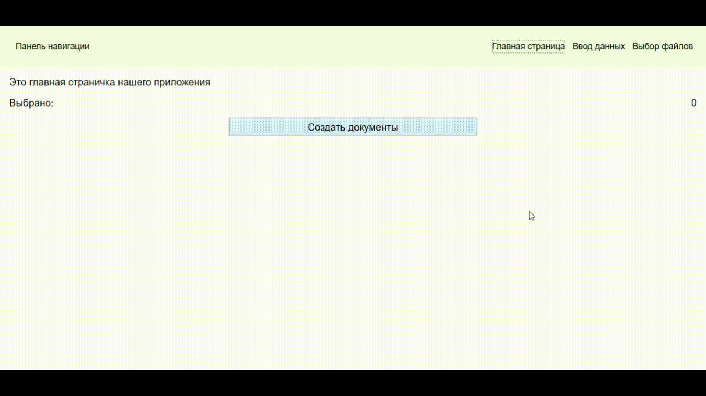
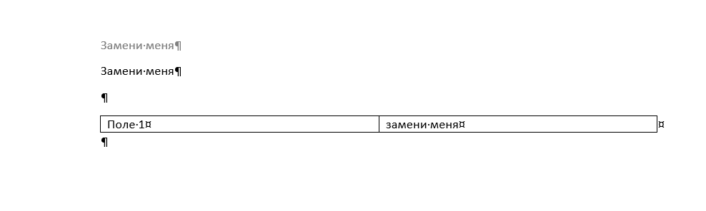
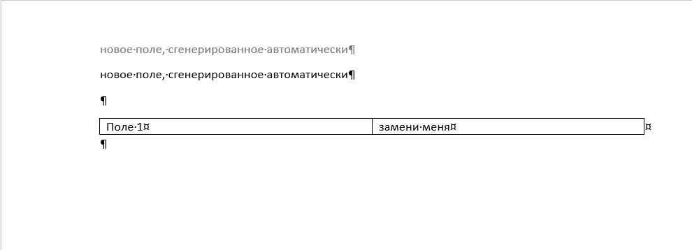

# Nova

### Описание приложения
Приложение для генерации word-документов. Заменяет в документах, которые являются эталонными, определённые слова на другие. Принцип словаря, где есть ключ и значение.

С помощью простого wpf приложения собирается информация, которая содержит в себе пути к файлам, которые необходимо менять, и словарь, формата <строка, строка>

### Демонстрация внешнего вида приложения и его работы:

### Демонстрация файла, который подаётся на вход

### Демонстрация файла, который будет на выходе

